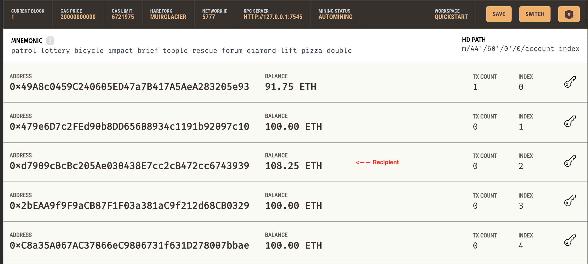

# Fintech Finder

This app is for companies looking to hire fintech professionals, and pay their wages in Ethereum. The version here in this repository uses Ganache Ethereum test-network, to show as an example and display the utility. 

To run the application:
```
streamlit run fintech_finder.py
```
Web3.py wallet code in crypto_wallet.py

Example transactions executed on the Ganache network:

